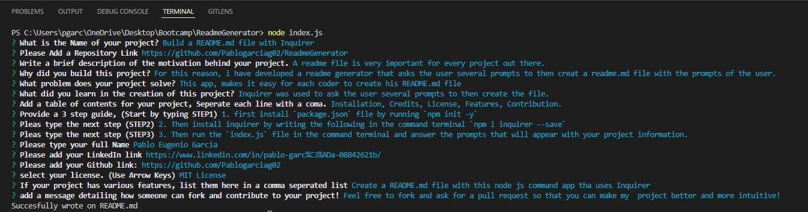

# Build a README.md file with Inquirer

# Github Repository
https://github.com/Pablogarciag02/ReadmeGenerator

## About this Project: 
-A readme file is very important for every project out there.

-For this reason, i have developed a readme generator that asks the user several prompts to then creat a readme.md file with the prompts of the user.

-This app, makes it easy for each coder to create his README.md file

-Inquirer was used to ask the user several prompts to then create the file.

## Table of Contents
Installation, Credits, License, Features, Contribution.

## Instalation (How to install)
Step 1: First install `package.json` file by running `npm init -y`

Step 2: Then install inquirer by writing the following in the command terminal `npm i inquirer --save`

Step 3: Then run the `index.js` file in the command terminal and answer the prompts that will appear with your project information. 

## Credits
Created by: Pablo Eugenio Garcia

LikedIn: https://www.linkedin.com/in/pablo-garc%C3%ADa-08842621b/

Github: https://github.com/Pablogarciag02

## License
MIT License

## Features
Create a README.md file with this node js command app tha uses Inquirer

## How to Contribute
Feel free to fork and ask for a pull request so that you can make my  project better and more intuitive!
